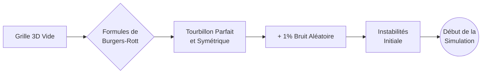
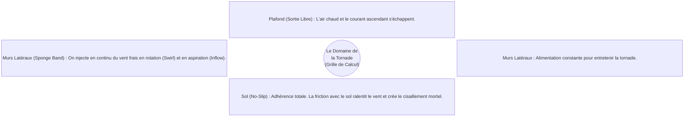

# Au Cœur du Moteur : Comment la Simulation Prend Vie

Ce document vulgarise la mécanique interne du simulateur. Nous allons explorer comment le programme passe d'une grille vide à un monstre météorologique chaotique et imprévisible tournant en temps réel à 60 images par seconde.

---

## 1. L'Espace Numérique : Le Domaine de Calcul

Avant qu'il y ait du vent, il faut définir l'espace. Le simulateur divise l'environnement virtuel en une grille 3D invisible composée de millions de petits cubes ou "cellules" (les voxels). 

Dans chaque cube de cette grille, la carte graphique (GPU) mémorise et met à jour en permanence trois éléments :
1. **Un vecteur de vitesse 3D** $\vec{v} = (v_x, v_y, v_z)$ représentant la direction et la force du vent.
2. **La pression locale** $p$.
3. **La quantité d'eau condensée** (le nuage).

---

## 2. L'Étincelle : Les Conditions Initiales

On ne peut pas simplement lancer le programme avec de l'air parfaitement immobile et espérer qu'une tornade apparaisse spontanément. L'ordinateur a besoin d'un "coup de pouce" initial. C'est l'étape de **l'ensemencement** (Seeding).

### Le Sculpteur Mathématique
À la toute première image (Frame 0), le programme remplit la grille 3D en utilisant le modèle mathématique de **Burgers-Rott** (voir document précédent). Il sculpte un tourbillon parfait au centre de la grille.

### Le Rôle Crucial du Chaos (Le Bruit)
Un tourbillon mathématiquement parfait est extrêmement instable dans la réalité, mais "trop parfait" dans un ordinateur : il resterait figé dans sa perfection symétrique. 
Pour que la nature chaotique des fluides prenne le dessus (turbulences, subdivision en plusieurs vortex), le programme injecte artificiellement **1% de bruit aléatoire** (du "bruit blanc") dans les vecteurs de vent à l'initialisation.

---

## 3. La Boucle Temporelle : Ce qui se passe à chaque image

Une fois la scène initialisée, l'horloge démarre. Chaque image (frame) calculée par l'écran représente une fraction de seconde ($\Delta t$) dans le simulateur.

Le vent est un fluide (l'air). Pour savoir comment l'air va bouger à l'instant suivant, le programme applique une version simplifiée des redoutables **équations de Navier-Stokes** en 4 grandes étapes exécutées séquentiellement par le processeur graphique :

### Étape 1 : L'Advection (Le Vent pousse le Vent)
L'air en mouvement transporte... lui-même. C'est le phénomène d'advection.
Le programme utilise une technique appelée **Semi-Lagrangienne**. Au lieu de pousser l'air vers l'avant (ce qui peut créer des trous dans la grille), le programme part de chaque cellule, "remonte le temps" en regardant d'où venait le vent, et attrape l'air qui s'y trouvait.

L'équation conceptuelle est l'accélération convective :
$$ \frac{\partial \vec{v}}{\partial t} + (\vec{v} \cdot \nabla)\vec{v} = 0 $$

### Étape 2 : L'Évaluation de la Divergence (Chercher les embouteillages)
L'air de la tornade (à ces vitesses) est considéré comme **incompressible**. Cela implique que dans chaque cube d'air, la quantité d'air qui entre doit être exactement égale à celle qui sort.

$$ \nabla \cdot \vec{v}^* = 0 $$

Le programme calcule la divergence $\nabla \cdot \vec{v}^*$ de l'étape précédente. Si un cube a trop d'air qui entre (divergence négative) ou trop d'air qui sort (divergence positive), il crée une erreur numérique qu'il faut corriger.

### Étape 3 : Le Solveur de Pression (L'Équilibre)
C'est l'étape la plus gourmande en calculs. Pour lisser les "embouteillages" (divergences), le fluide va ajuster sa pression. L'air va naturellement fuir les zones de haute pression vers les zones de basse pression. 
Le programme exécute l'**Équation de Poisson pour la pression** en boucle (méthode de Jacobi) jusqu'à ce que la pression s'équilibre sur toute la grille 3D.

$$ \nabla^2 p = \frac{\rho}{\Delta t} \nabla \cdot \vec{v}^* $$

### Étape 4 : La Projection (La Correction)
Maintenant que la carte des pressions est connue, le programme modifie les vents initiaux en les repoussant selon le gradient de pression ($\nabla p$). Le champ de vent est désormais mathématiquement "propre" (divergence nulle) et prêt à être affiché.

---

## 4. La Boîte Virtuelle : Les Conditions aux Limites

Si la simulation n'était qu'une simple boîte fermée, le tourbillon s'épuiserait rapidement à cause des frottements. Pour que la tornade "vive" continuellement, il faut simuler l'immense orage (la supercellule) qui se trouve au-dessus d'elle et l'environnement qui l'entoure.

C'est là qu'interviennent les **Conditions aux Limites (Boundary Conditions)** appliquées aux bords de la grille :

1. **Au Sol (z = 0)** : Condition de "No-Slip" (sans glissement). L'air en contact avec le sol est forcé à avoir une vitesse de $0 \text{ m/s}$. Ce frottement brutal crée des turbulences énormes à la base, arrachant la matière.
2. **Sur les côtés (Cylindre latéral)** : Une "bande éponge" force continuellement l'air entrant à correspondre à un certain flux rotatif, imitant l'aspiration d'un grand orage à l'échelle kilométrique.
3. **Au Plafond** : L'air est libre de sortir (gradient nul), emportant avec lui l'énergie ascendante.

---

## 5. Habillage : Particules et Nuages

La physique gère les vents invisibles. Pour que nous puissions voir la tornade, le simulateur utilise deux artifices visuels propulsés par cette matrice de vent :

### Le système de Débris (Poussière)
Des milliers de particules virtuelles sont générées au ras du sol. Chaque particule lit le vent de la grille 3D à son emplacement exact et se laisse porter. Lorsqu'une particule sort de la boîte ou meurt de vieillesse (au bout de quelques secondes), elle "respawn" au niveau du sol, imitant un nuage de poussière perpétuellement soulevé.

### Le Rendu Volumétrique (Le Tuba)
La pression $p$ calculée à l'étape 3 n'est pas juste jetée. Plus la pression chute brutalement (notamment au centre strict du vortex), plus la température baisse. Le code thermodynamique calcule si cette baisse permet de franchir le seuil de condensation ($LCL$). Là où l'air condense, la grille stocke une valeur de densité de nuage ("cloud water"), qui sera lue par un shader de lancer de rayons (Raymarching) pour dessiner l'entonnoir nuageux, texturé et ombré de façon réaliste.

La simulation est donc une danse perpétuelle : **La physique crée les forces $\rightarrow$ les forces déplacent le vent $\rightarrow$ le vent condense l'eau et soulève la poussière $\rightarrow$ la poussière rend la mathématique visible à nos yeux.**