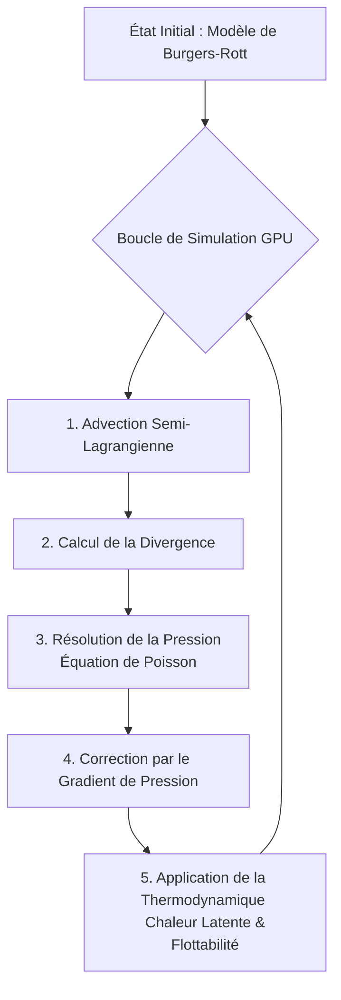

# La Physique des Tornades : Théorie et Modélisation Scientifique

Ce document explore la physique derrière les tornades et explique les principes mathématiques et thermodynamiques utilisés par notre simulateur pour modéliser ces phénomènes extrêmes en temps réel. 

---

## 1. Comprendre la Dynamique d'une Tornade

Une tornade est un tourbillon de vents extrêmement violents, prenant naissance à la base d'un nuage orageux (souvent un cumulonimbus supercellulaire) et atteignant la surface de la terre. 

### Les Ingrédients Fondamentaux
La genèse d'une tornade nécessite la combinaison de plusieurs éléments physiques :
1. **Instabilité Thermodynamique** : De l'air chaud et humide à la surface qui s'élève rapidement (courant ascendant).
2. **Cisaillement des Vents** : Des vents changeant de vitesse et de direction avec l'altitude, créant un tube d'air en rotation horizontale.
3. **Étirement Vertical** : Le puissant courant ascendant de l'orage redresse ce tube de rotation à la verticale et l'étire. En vertu de la **conservation du moment cinétique** (comme une patineuse qui ramène ses bras pour tourner plus vite), le diamètre du tube se réduit et la vitesse de rotation augmente drastiquement.

---

## 2. Le Modèle Analytique de Burgers-Rott

Pour initialiser notre simulation avec une structure de vent réaliste, le simulateur utilise le **modèle du tourbillon de Burgers-Rott**. Il s'agit d'une solution analytique exacte des équations de Navier-Stokes pour un fluide visqueux, qui décrit un tourbillon stationnaire entretenu par un flux radial entrant (aspiration) et un étirement vertical.

### Les Équations du Tourbillon

Le champ de vent est décomposé en trois composantes cylindriques : la vitesse tangentielle (la rotation), la vitesse radiale (l'aspiration vers le centre), et la vitesse verticale (l'ascendance).

**1. La vitesse tangentielle (rotation) :**
C'est la composante la plus destructrice. La vitesse augmente depuis le centre jusqu'au rayon de vent maximum ($R_{max}$), puis décroît vers l'extérieur.

$$
v_\theta(r) = V_{max} \cdot \left( \frac{R_{max}}{r} \right) \cdot \frac{1 - \exp\left(-\alpha \cdot \left(\frac{r}{R_{max}}\right)^2\right)}{1 - \exp(-\alpha)}
$$

*Où :*
* $V_{max}$ est la vitesse tangentielle maximale de la tornade.
* $R_{max}$ est le rayon où cette vitesse maximale est atteinte.
* $\alpha \approx 1.25643$ est une constante mathématique assurant que le pic de vitesse se situe exactement à $R_{max}$.

**2. La vitesse radiale (aspiration) :**
L'air est aspiré vers le centre de la tornade par la dépression.

$$
v_r(r, z) = -a \cdot r
$$

**3. La vitesse verticale (étirement) :**
Une fois l'air aspiré au centre, il est violemment propulsé vers le haut, ce qui maintient le tourbillon.

$$
w(z) = 2 \cdot a \cdot z
$$

*Où $a$ est le taux d'étirement, directement proportionnel à l'afflux d'air (inflow) aux frontières du domaine.*

---

## 3. Le Moteur de Simulation (LES - Large Eddy Simulation)

Le modèle de Burgers-Rott n'est qu'un point de départ statique. Pour simuler le chaos, les turbulences et l'évolution temporelle de la tornade, le programme utilise un solveur **LES (Large Eddy Simulation)** calculé directement sur la carte graphique (GPU). 

La méthode LES simule directement les grands tourbillons de l'air et modélise mathématiquement les plus petits (qui sont plus petits que la grille de calcul) pour optimiser les performances.

### La Méthode de Projection de Chorin-MacCarthy

Pour résoudre les fluides incompressibles (l'air à ces vitesses se comporte comme un fluide incompressible), le solveur utilise une technique mathématique en 4 étapes pour mettre à jour la vitesse de l'air ($v$) et la pression ($p$) à chaque image de la simulation :

**Étape 1 : Advection Semi-Lagrangienne**
On calcule comment le vent transporte l'air lui-même. On trace l'origine de chaque particule d'air en remontant le temps, ce qui offre une grande stabilité numérique.

**Étape 2 : Calcul de la Divergence**
On évalue si la matière s'accumule ou s'échappe en un point :
$$ \text{Divergence} = \nabla \cdot v^* $$

**Étape 3 : L'Équation de Poisson pour la Pression (Solveur de Jacobi)**
Parce que l'air simulé est incompressible, la divergence doit être nulle ($\nabla \cdot v = 0$). S'il y a de la divergence, c'est que la pression doit réagir. On résout itérativement l'équation de Poisson :
$$ \nabla^2 p = \nabla \cdot v^* $$

**Étape 4 : Soustraction du Gradient de Pression**
On corrige les vitesses pour forcer la conservation de la masse :
$$ v^{n+1} = v^* - \nabla p $$

---

## 4. Thermodynamique et Formation du Tuba (Entonnoir)

Ce qui rend une tornade visible, au-delà des débris, c'est la condensation de la vapeur d'eau due à la chute de pression extrême en son centre. 

### Pression de Vapeur Saturante
La capacité de l'air à contenir de la vapeur d'eau invisible dépend de sa température. La formule empirique d'**August-Roche-Magnus** permet de calculer cette pression de saturation ($e_s$) en fonction de la température en degrés Celsius ($T_c$) :

$$
e_s(T_c) = 611.2 \cdot \exp\left(\frac{17.67 \cdot T_c}{T_c + 243.5}\right)
$$

### Le LCL (Lifting Condensation Level)
Le LCL correspond à l'altitude à laquelle un paquet d'air ascendant devient saturé en humidité, créant ainsi la base du nuage et le tuba visible de la tornade. Le programme utilise une approximation de la formule de Lawrence/Espy :

$$
z_{LCL} \approx 125 \cdot (T_c - T_d)
$$

*Où $T_d$ est la température du point de rosée, calculée via l'inversion de la formule de Magnus avec l'humidité relative (RH).*
Dans la zone de très basse pression au centre du vortex, l'air se détend et se refroidit (détente adiabatique), ce qui fait chuter le LCL jusqu'au niveau du sol, matérialisant l'entonnoir caractéristique.

### Le Moteur Thermique : Chaleur Latente
Quand la vapeur d'eau se condense pour former le nuage, elle libère une énergie colossale : la **chaleur latente**. 
Dans le simulateur, cela se traduit par une force de flottabilité vers le haut ($F_z$), qui entretient et accélère l'aspiration de la tornade :

$$
F_z \propto \frac{L_v}{c_p \cdot T_0} \cdot \rho_c \cdot g
$$

*Où $\rho_c$ est la densité d'eau condensée, $L_v$ la chaleur latente de vaporisation, et $g$ la gravité.*

---

## 5. Le Ratio de "Swirl" (Tourbillonnement)

Dans la dynamique des tornades simulée, la structure géométrique du vortex (s'il s'agit d'une simple colonne, ou d'un monstre massif à multiples vortex) est dictée par un paramètre fondamental : le **Swirl Ratio** ($S$).

Ce ratio compare l'intensité de la rotation (tangentielle) à l'intensité de l'aspiration (radiale) :

$$
S = \frac{v_{\theta, \text{frontière}}}{v_{r, \text{frontière}}} \approx \frac{R \cdot v_\theta}{2 \cdot v_r \cdot H}
$$

* **Si $S$ est bas (< 0.5)** : Le flux radial domine. La tornade forme un vortex unique, lisse et étroit (type "trombe d'eau" ou petite tornade).
* **Si $S$ est élevé (> 1.0)** : La rotation est écrasante. Le courant descendant central atteint le sol et le vortex principal se scinde en plusieurs **sous-vortex de succion** erratiques. C'est la configuration typique des tornades destructrices de catégorie EF4 ou EF5. Le simulateur est conçu pour reproduire fidèlement cette transition complexe.
