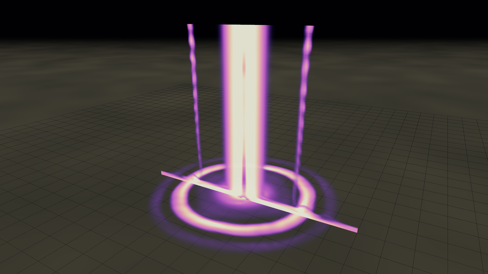
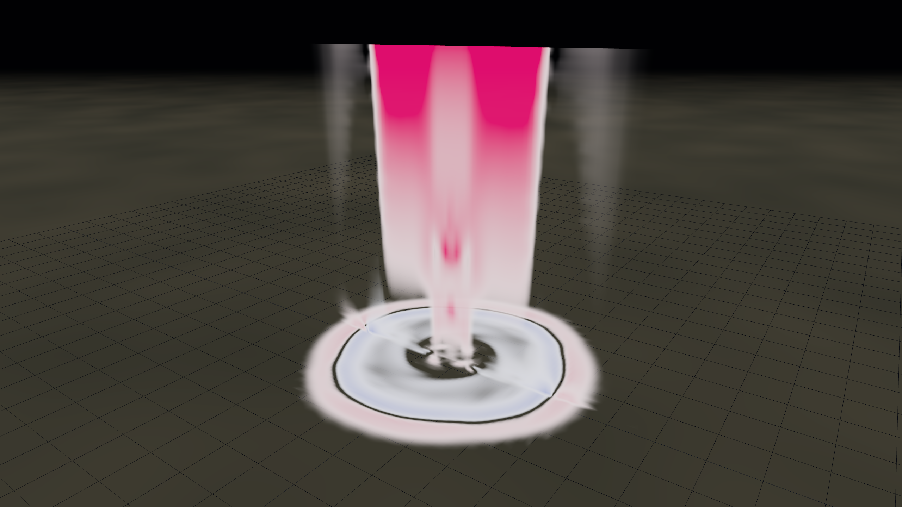
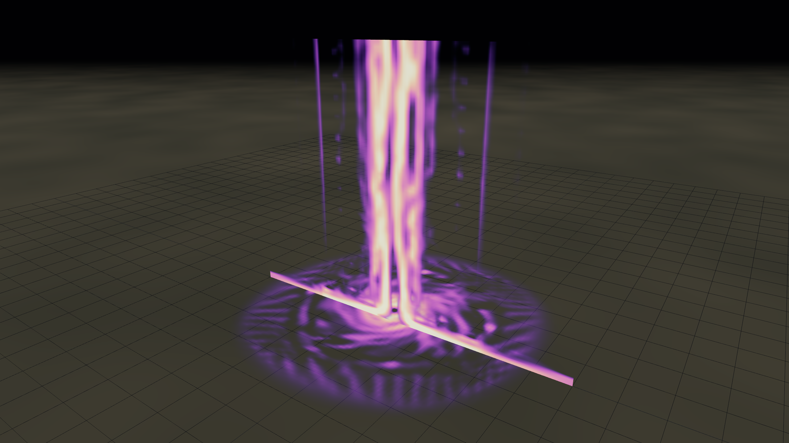
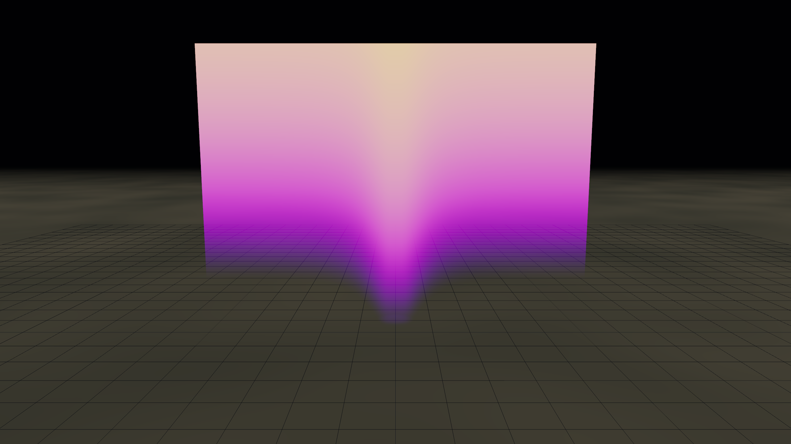

# Comment fonctionne une tornade

> 🌪️ **Démo en direct** : <https://tornado-sim.puter.site/>
> &nbsp; · &nbsp;
> 🌀 **Autre simulation interactive** par Phantom (PhantomBlast28 sur TikTok,
> @phantomblast666) : <https://tornade-phantom.puter.site/>
> &nbsp; · &nbsp;
> 📦 **Code source** : <https://github.com/TheSamLePirate/tornado-simulator>
>
> Chaque illustration de cette doc a un **préréglage correspondant** dans
> l'application — utilisez le menu "📷 Préréglage…" pour voir n'importe
> quelle figure en direct, navigable à la souris ou au doigt, avec les
> vrais paramètres derrière.

Une explication illustrée à partir des sorties en direct du simulateur.
Chaque image ci-dessous est une vraie capture PNG du canvas WebGPU —
pas de schéma, pas d'illustration de manuel. Ce que vous voyez,
c'est ce que le solveur Navier–Stokes a réellement produit à partir
des paramètres indiqués dans chaque légende.

---

## Comment utiliser l'application

L'application démarre directement en **vue scientifique**, la plus utile
pour comprendre la tornade. La vue présente un cube de simulation WebGPU :
les coupes colorées, les lignes de courant et les isosurfaces sont toutes
calculées à partir du champ de vent simulé.

### Sur mobile

- Le panneau principal est en bas de l'écran.
- **Champ** choisit ce que l'on visualise : vitesse, pression, vorticité,
  nuage, température, etc.
- Le menu **📷 Préréglage…**, juste à droite de **Champ**, charge les vues
  qui correspondent aux figures de cette documentation.
- **↻ Réinit.** relance l'état initial avec les paramètres actuels.
- **📘 Doc** ouvre cette documentation.
- **Options** ouvre un panneau déroulant. Faites défiler ce panneau pour
  accéder aux couches, coupes, contraste, isosurfaces, pause et autres
  réglages actifs.
- Le petit panneau **Params** en haut à droite est volontairement replié :
  ouvrez-le seulement si vous voulez modifier les paramètres physiques du
  modèle.
- La carte en haut de la simulation indique le **titre de la vue** et sa
  **légende de couleurs** ; elle reste proche du cube pour pouvoir lire la
  scène sans chercher ailleurs.

### Sur ordinateur

- Les commandes principales sont en haut à gauche.
- Les boutons de **champ** (`|V|`, `V_θ`, `V_r`, `V_z`, `ΔP`, `|ω|`,
  `nuage`, `T'`) changent la grandeur affichée.
- Les boutons de **couches** activent ou masquent les isosurfaces, flèches,
  lignes de courant, contours, LIC, fondu et volume de vorticité.
- Les curseurs règlent les coupes `XZ` et `XY`, le contraste du champ, et
  les paramètres propres aux couches actives.
- **📷 Préréglage…** charge une scène prête à commenter ; **📘 Doc** ouvre
  cette page ; **↻ Réinit.** relance la simulation avec les paramètres
  courants.
- Le panneau **Paramètres** en haut à droite est replié par défaut. Ouvrez-le
  pour modifier `Rmax`, `Vmax`, le rapport de rotation `S`, l'afflux, la
  température, l'humidité, etc.
- Le panneau en bas à gauche affiche uniquement des **mesures réelles de la
  simulation** lues depuis le GPU : vitesse maximale, chute de pression,
  vorticité maximale et âge des données.

---

## 1. Qu'est-ce qu'une tornade ?

Une tornade est une colonne d'air en rotation violente reliant un nuage
d'orage en altitude au sol. Son trait caractéristique est la
**vorticité** — une mesure de l'intensité du tourbillonnement local
en chaque point. Si l'on trace les régions où la vorticité dépasse
un certain seuil, on obtient ceci :


*Trois enveloppes imbriquées de |ω| (norme de la vorticité) à des seuils
croissants. L'enveloppe extérieure bleue marque « là où ça tourne » ;
l'enveloppe intérieure orange indique le cœur en rotation violente.
Le sol est en bas, la base du nuage serait juste au-dessus du cadre.*

*▶ Preset app : « Tube de vorticité (iso) »*

Le tube est **étroit mais haut** — typiquement 50 à 500 m de diamètre,
sur plusieurs kilomètres de hauteur. À l'intérieur du tube, les vents
peuvent dépasser 100 m/s (échelons EF4–EF5 sur l'échelle de Fujita
améliorée).

Vu en coupe plutôt qu'en isosurface, le même tube ressemble à ça :



*Coupes XZ et XY de la vorticité. La **colonne magenta** sur la coupe
verticale, c'est la concentration de rotation au cœur. Au sol, on voit
l'**anneau** correspondant — c'est la signature du mur de l'œil au
ras du sol. Les stries pâles qui descendent le long du tube trahissent
la structure hélicoïdale fine de l'écoulement turbulent.*

*▶ Preset app : « Coupe de |ω| »*

---

## 2. La signature : rotation autour d'un axe vertical

Si l'on coupe horizontalement la base du tube et que l'on colorie la
vitesse **tangentielle** du vent (positive = sens trigonométrique vu
d'en haut), l'empreinte d'un tourbillon saute aux yeux :


*Vitesse tangentielle V_θ sur une coupe horizontale à z ≈ 50 m.
Rose = forte rotation antihoraire (positive) ; blanc = calme.
L'**anneau** lumineux est le mur de l'œil — une bande étroite où la
vitesse atteint son maximum. À l'extérieur de l'anneau, le vent
décroît ; à l'intérieur, il décroît aussi vers un cœur quasi immobile.
C'est le profil du **tourbillon de Rankine combiné**.*

*▶ Preset app : « V_θ (vue du dessus) »*

Le rayon de cet anneau est l'un des deux nombres qui définissent une
tornade : **`R_max`** — la distance entre l'axe et le pic de vent.
Le pic lui-même est **`V_max`**. Ces deux valeurs résument à elles
seules la taille et la puissance du phénomène.

---

## 3. D'où vient l'air ?

L'air ne tourne pas indéfiniment dans une boucle fermée — il doit
venir de quelque part et aller quelque part. La vitesse **radiale**
(composante du vent dirigée vers l'axe ou s'en éloignant) révèle
l'afflux :


*Vitesse radiale V_r sur la même coupe horizontale basse. Bleu = afflux
(air se dirigeant vers l'axe), rouge = sortie (absente ici). L'air au
ras du sol est aspiré **vers l'intérieur** depuis toutes les directions.*

*▶ Preset app : « V_r (vue du dessus) »*

Cet afflux doit bien aller quelque part — et comme il ne peut
s'accumuler sur l'axe, il monte. La tornade est essentiellement un
gigantesque tube aspirant : convergence horizontale au sol, courant
ascendant vertical jusque dans l'orage parent.

Ce courant ascendant se voit directement sur la composante verticale
du vent V_z :



*Vitesse verticale V_z aux paramètres par défaut (V_max = 95 m/s,
S = 0,75). Rose/rouge = ascendance, blanc = quasi calme. La **colonne
rose** au centre est le courant ascendant qui propulse l'air aspiré
par l'afflux jusque dans le nuage convectif. À S = 0,75 (juste
au-dessus du seuil bicellulaire), la concentration est déjà très
serrée le long de l'axe.*

*▶ Preset app : « V_z par défaut »*

---

## 4. Le déficit de pression (et pourquoi l'air se précipite)

Pourquoi l'air converge-t-il, au juste ? La deuxième loi de Newton :
pour qu'une parcelle d'air décrive un cercle, il faut une force
centripète dirigée vers l'axe. La nature la fournit via un **gradient
de pression** — la pression doit être plus basse au centre qu'à
l'extérieur, de sorte que l'air soit « pressé » vers l'intérieur.


*Écart de pression ΔP par rapport à l'ambiant. Rose = au-dessus de
l'ambiant, bleu = au-dessous. La **colonne** bleu profond le long de
l'axe du tourbillon est le déficit cyclostrophique, où ΔP ≈ −ρ · V_max².
À V_max = 95 m/s avec ρ ≈ 1,2 kg/m³, cela donne environ −110 hPa —
soit **environ 10 % de moins que la pression atmosphérique au niveau
de la mer**, dans une colonne d'à peine 50 m de large.*

*▶ Preset app : « Déficit de pression »*

C'est ce déficit qui détruit réellement les bâtiments : les vents
violents tirent sur la structure pendant que la chute de pression
tente d'arracher la toiture.

---

## 5. Conséquence directe — le refroidissement adiabatique

Le déficit de pression du chapitre précédent a une autre conséquence,
et c'est elle qui rend la tornade visible : **quand un gaz se détend,
il se refroidit**. C'est la loi de l'adiabatique sèche, qu'on apprend
au lycée et qui décrit ce qui se passe à chaque instant dans
l'atmosphère.

Mathématiquement, pour un gaz parfait subissant une transformation
sans échange de chaleur :

```
T_local = T₀ · (p_local / p_référence)^(R/c_p)
```

avec R/c_p ≈ 0,286 pour l'air sec. Concrètement : si la pression
chute de 10 % à température constante d'origine, la température
chute d'environ 3 %. Au cœur d'une tornade EF4 où ΔP atteint −100 hPa
(soit −10 % de la pression atmosphérique normale), cela donne
**ΔT ≈ −9 K**.

On peut directement visualiser ce refroidissement dans le simulateur :



*Coupe XZ et slab XY de la déviation de température T' (par rapport
à l'isentrope sèche locale). Bleu = plus froid, rouge = plus chaud.
La **colonne magenta-bleue** sur l'axe est exactement la même région
que la colonne bleue de la coupe de pression précédente — ce sont
deux visualisations du même phénomène : la décompression centripète
qui refroidit l'air en montant le long du tube. Les zones
décolorées autour ont une déviation proche de zéro.*

*▶ Preset app : « T' (refroidissement adiabatique) »*

Comparez les deux presets dans l'app : « Déficit de pression » et
« T' (refroidissement adiabatique) » montrent la même structure
spatiale dans deux palettes différentes. C'est la **cause** (la
chute de pression) et l'**effet** (la chute de température),
strictement liés par l'équation ci-dessus.

---

## 6. Le nuage funnel — pourquoi on voit la tornade

Le déficit de pression a une conséquence visible : l'air qui spirale
vers l'axe se détend en montant ; en se détendant, il refroidit ; et
en refroidissant suffisamment, sa vapeur d'eau **se condense**. C'est
ce qui rend la tornade visible — un nuage en forme d'entonnoir
descend depuis la base du nuage convectif jusqu'au sol.



*Coupe XZ de la densité d'eau condensée ρ_c (colormap plasma).
Le **plafond rose** uniforme, c'est la base du nuage convectif au-dessus
du **niveau de condensation par soulèvement** (LCL). En dessous, l'air
est trop chaud et trop sec pour qu'il y ait de la condensation —
sauf le long de l'axe du tourbillon, où le déficit cyclostrophique
abaisse la pression au point que la condensation y descend en
**entonnoir** quasiment jusqu'au sol. C'est précisément la silhouette
caractéristique d'une tornade.*

*▶ Preset app : « Funnel (nuage condensé) »*

L'humidité ambiante détermine la hauteur du LCL — plus l'air est
sec, plus le LCL est haut, plus le funnel reste « accroché » au
nuage et ne touche pas le sol. Une tornade dans de l'air sec est
donc en grande partie **invisible** : seul le nuage de poussière
soulevé au sol trahit son existence.

---

## 7. La vue d'ensemble (visualisation par LIC)

Jusqu'ici, nous avons découpé le vent en V_θ, V_r, V_z — mais le
flux réel est une spirale tourbillonnante combinant les trois. En
traçant la **norme** du vent avec une **convolution par intégrale
linéaire** (LIC) par-dessus, on capture tout en une seule image :


*Coupe de |V| avec grain LIC dans le sens du flux. Jaune = vitesse
élevée (mur de l'œil, ~80 à 95 m/s), sombre = calme. En regardant de
près, on aperçoit les **fines stries qui filent tangentiellement** le
long du mur de l'œil — c'est le noyau LIC qui révèle la direction de
l'écoulement à chaque pixel. Le slab horizontal au sol donne la cible
classique : mur de l'œil lumineux, œil sombre, halo qui s'estompe
dans la zone d'afflux.*

*▶ Preset app : « |V| + LIC »*

C'est exactement ce que donnerait une superposition radar
Doppler réflectivité-et-vitesse d'une vraie tornade, à beaucoup plus
fine résolution.

---

## 8. Unicellulaire vs bicellulaire — le **rapport de swirl**

Détail subtil mais important : toutes les tornades ne se ressemblent
pas à l'intérieur. Il existe un paramètre de contrôle, le **rapport
de swirl** S — grossièrement, le rapport entre la rotation de l'air
au bord du domaine et son afflux radial. Le franchissement d'un
seuil critique (S ≈ 0,6, le **seuil de Davies-Jones**) fait basculer
le tourbillon dans un régime différent.

**Faible swirl (S = 0,4) — tourbillon unicellulaire :**


*V_z au rapport de swirl 0,4. Le tourbillon est unicellulaire :
l'air monte partout le long de l'axe. Le tube est laminaire, la
colonne est un courant ascendant continu et homogène.*

*▶ Preset app : « V_z à S = 0.4 (unicellulaire) »*

**Swirl plus élevé (S = 0,85) — colonne étroite et concentrée :**


*Même vue à S = 0,85. Le courant ascendant s'est resserré en une
colonne d'une intensité éclatante. Dans les vraies tornades (et à des
résolutions de grille plus fines que cette simulation 96³), le centre
de la colonne deviendrait en réalité **négatif** — un courant
descendant plongeant le long de l'axe pendant que l'ascendance
migrerait vers un anneau juste à l'extérieur. C'est l'iconique
structure « bicellulaire ».*

*▶ Preset app : « V_z à S = 0.85 (bicellulaire) »*

---

## 9. Éclatement tourbillonnaire — ce que font les tornades les plus violentes

Si l'on pousse le rapport de swirl assez haut (S ≈ 1,2 ici), le
courant descendant central du tourbillon bicellulaire devient
instable. Le tube unique **se fragmente en 2 à 6 sous-tourbillons**
qui orbitent autour de l'axe principal comme des engrenages d'un
système planétaire. Les vitesses de vent à *l'intérieur* des
sous-tourbillons s'ajoutent à la rotation du tourbillon parent —
produisant localement les vents les plus rapides jamais mesurés
dans l'atmosphère (~140 m/s, ~500 km/h).


*Coupes de vorticité à S = 1,2 avec V_max = 100 m/s. Le slab
horizontal en bas trahit le phénomène : au lieu d'un seul anneau
lumineux, on voit **plusieurs taches lumineuses arrangées en
spirale** — chacune un sous-tourbillon. La coupe verticale révèle
que le tube est passé d'une colonne lisse à une texture striée,
presque peignée, à mesure que les sous-tourbillons remontent.*

*▶ Preset app : « Multi-tourbillonnaire (S = 1.2) »*

Les tornades d'El Reno (2013), de Hackleburg (2011) et de
Greensburg (2007) ont toutes été observées en configuration
multi-tourbillonnaire pendant leurs phases les plus violentes.

---

## 10. La recette résumée

Pour fabriquer une vraie tornade, il faut :

1. **De l'air chaud et humide en surface** — le carburant de
   l'ascendance par flottabilité. Le simulateur le gère via le
   paramètre **chaleur latente** : à mesure que l'air humide
   s'élève dans le nuage et se condense, il libère de la chaleur
   latente qui entretient l'ascendance, qui aspire plus d'afflux,
   qui génère plus de rotation. La boucle s'auto-alimente.

2. **De l'air froid et sec en altitude** — accroît le contraste
   thermique, déstabilise la colonne, rend la convection violente.

3. **Du cisaillement de vent dans la basse atmosphère** — fournit la
   vorticité d'axe horizontal que l'ascendance bascule en vorticité
   verticale pour amorcer la rotation.

4. **Un déclencheur** — la supercellule parente et son mésocyclone,
   qui mettent en rotation la graine pendant de longues minutes
   avant que la tornade ne touche réellement le sol.

S'il manque un seul de ces ingrédients, on a de la pluie, on a un
orage, on a un *gustnado* — mais pas de tornade. Avoir les quatre
réunis au même endroit est météorologiquement rare, ce qui explique
que les tornades soient relativement peu fréquentes.

---

## 11. Comment lire le HUD du simulateur

Une fois la simulation lancée et le tourbillon formé, le HUD affiche
uniquement des valeurs **réellement mesurées dans la simulation** — pas
des objectifs théoriques ni des valeurs saisies dans les paramètres.
Ces mesures viennent d'une réduction GPU du champ 3D :

- **|V|max** — vitesse maximale réellement présente dans le domaine.
- **Vent** — conversion de cette vitesse maximale en mph.
- **ΔP min** — chute de pression minimale simulée, convertie en hPa.
- **|ω|max** — vorticité maximale réellement mesurée.
- **Âge données** — temps depuis la dernière lecture GPU réussie.
- **IPS** — images par seconde.

Sur mobile, le HUD est volontairement compact : il affiche seulement
l'intensité EF déduite du vent simulé, la vitesse maximale mesurée et
les IPS. Le détail complet reste disponible sur ordinateur.

---

*Toutes les figures ont été générées avec `bun capture --recipe …`
(ou des paramètres personnalisés) directement depuis le canvas
WebGPU de ce simulateur. Pour les regénérer, assurez-vous que
`bun dev` tourne, puis lancez `bun capture --all` pour rafraîchir
toutes les illustrations dans `docs/illustrations/`.*
