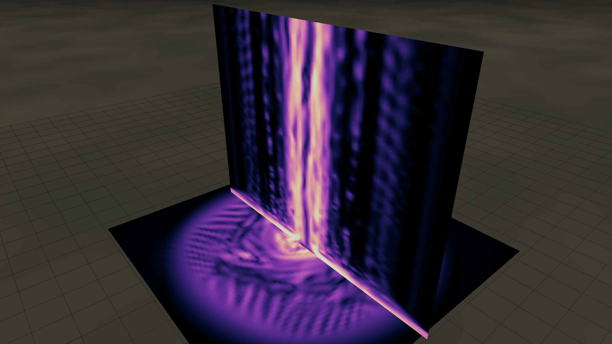
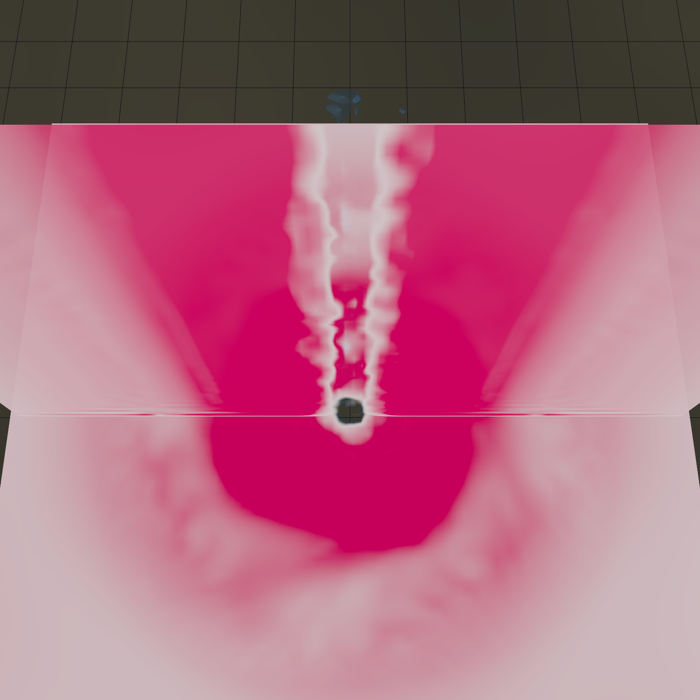
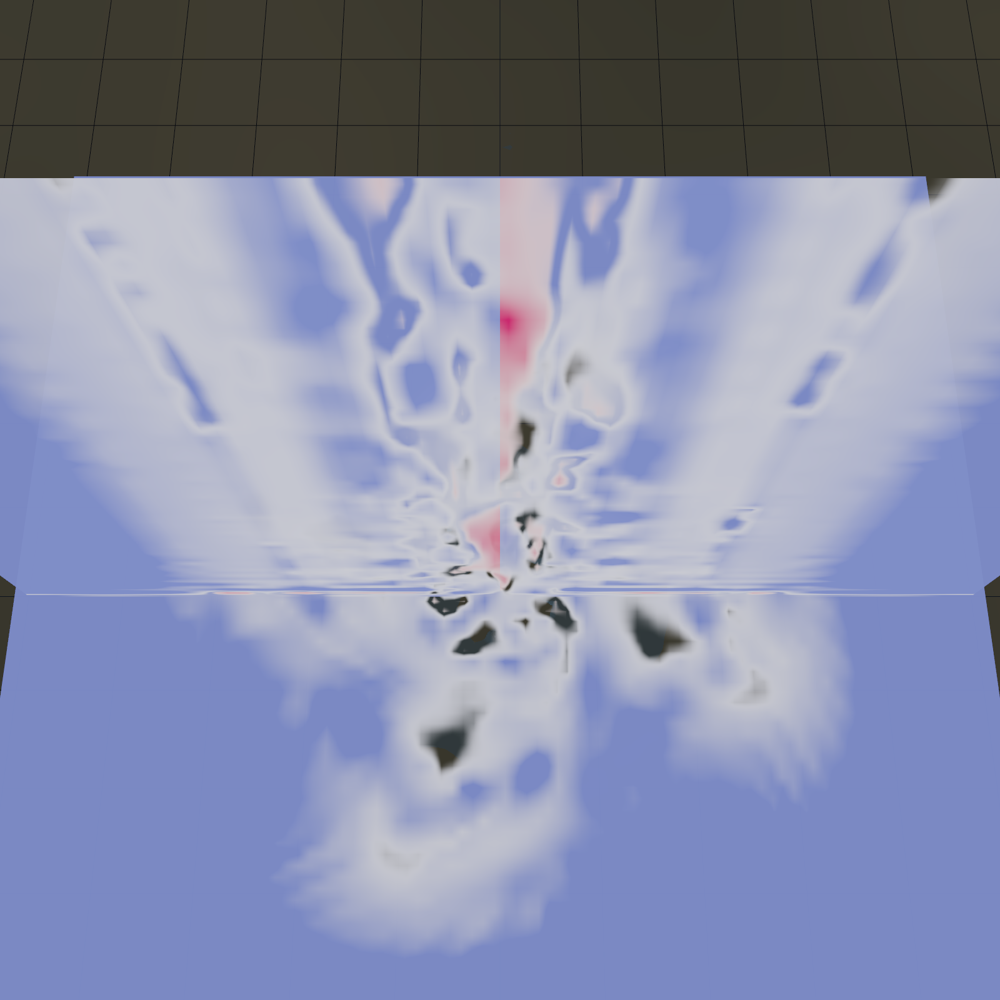
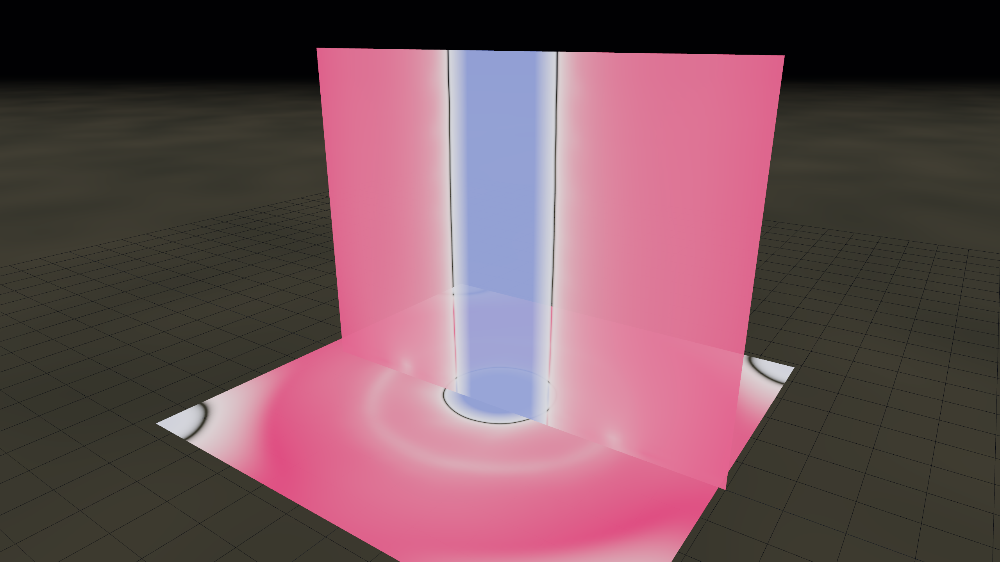
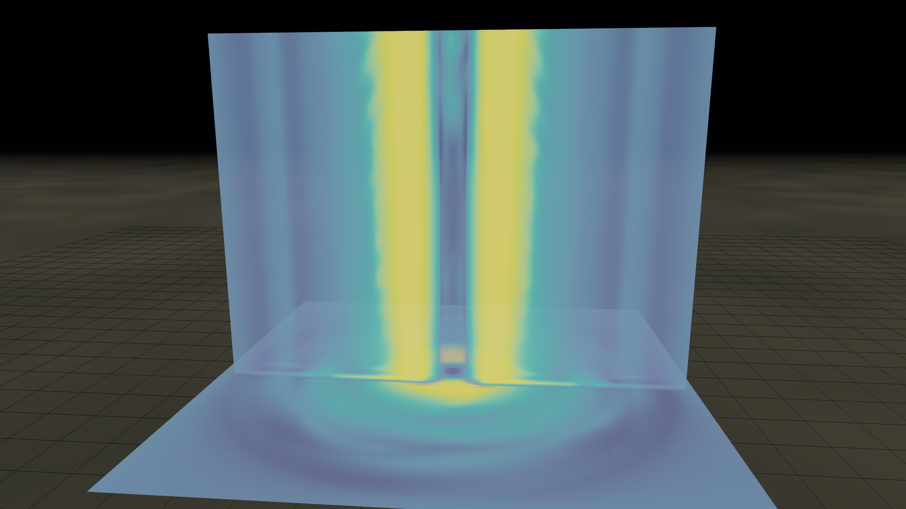
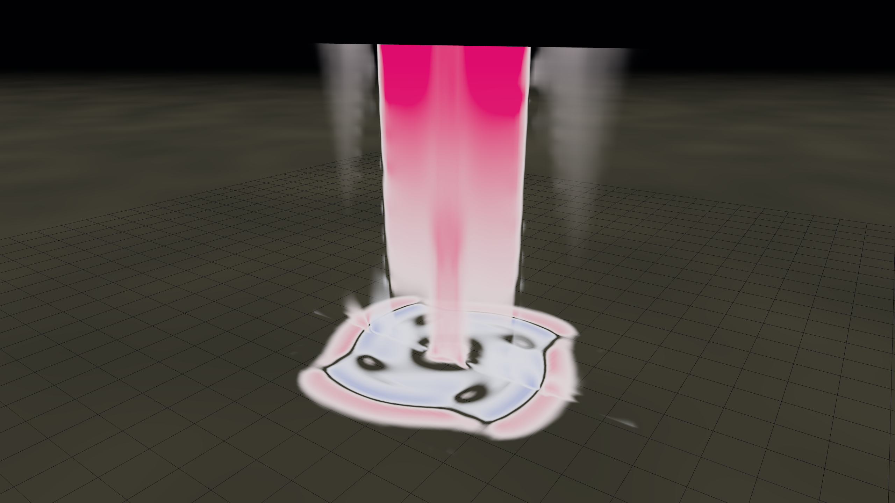
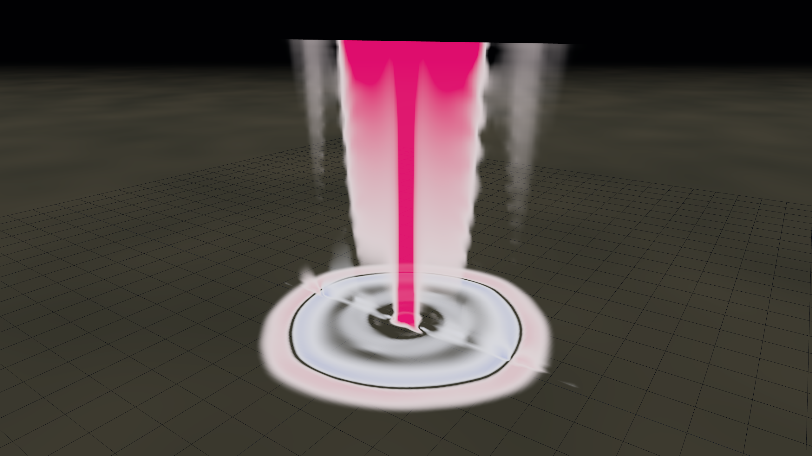
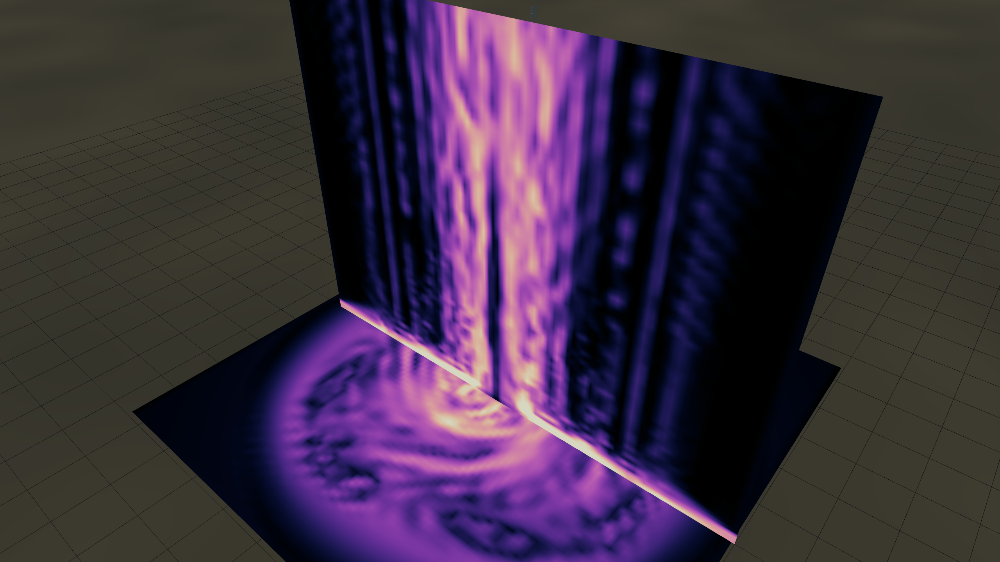

# Comment fonctionne une tornade

Une explication illustrée à partir des sorties en direct du simulateur.
Chaque image ci-dessous est une vraie capture PNG du canvas WebGPU —
pas de schéma, pas d'illustration de manuel. Ce que vous voyez,
c'est ce que le solveur Navier–Stokes a réellement produit à partir
des paramètres indiqués dans chaque légende.

---

## 1. Qu'est-ce qu'une tornade ?

Une tornade est une colonne d'air en rotation violente reliant un nuage
d'orage en altitude au sol. Son trait caractéristique est la
**vorticité** — une mesure de l'intensité du tourbillonnement local
en chaque point. Si l'on trace les régions où la vorticité dépasse
un certain seuil, on obtient ceci :

*Trois enveloppes imbriquées de |ω| (norme de la vorticité) à des seuils
croissants. L'enveloppe extérieure bleue marque « là où ça tourne » ;
l'enveloppe intérieure orange indique le cœur en rotation violente.
Le sol est en bas, la base du nuage serait juste au-dessus du cadre.*

Le tube est **étroit mais haut** — typiquement 50 à 500 m de diamètre,
sur plusieurs kilomètres de hauteur. À l'intérieur du tube, les vents
peuvent dépasser 100 m/s (échelons EF4–EF5 sur l'échelle de Fujita
améliorée).

---

## 2. La signature : rotation autour d'un axe vertical

Si l'on coupe horizontalement la base du tube et que l'on colorie la
vitesse **tangentielle** du vent (positive = sens trigonométrique vu
d'en haut), l'empreinte d'un tourbillon saute aux yeux :

*Vitesse tangentielle V_θ sur une coupe horizontale à z ≈ 50 m.
Rose = forte rotation antihoraire (positive) ; blanc = calme.
L'**anneau** lumineux est le mur de l'œil — une bande étroite où la
vitesse atteint son maximum. À l'extérieur de l'anneau, le vent
décroît ; à l'intérieur, il décroît aussi vers un cœur quasi immobile.
C'est le profil du **tourbillon de Rankine combiné**.*

Le rayon de cet anneau est l'un des deux nombres qui définissent une
tornade : **`R_max`** — la distance entre l'axe et le pic de vent.
Le pic lui-même est **`V_max`**. Ces deux valeurs résument à elles
seules la taille et la puissance du phénomène.

---

## 3. D'où vient l'air ?

L'air ne tourne pas indéfiniment dans une boucle fermée — il doit
venir de quelque part et aller quelque part. La vitesse **radiale**
(composante du vent dirigée vers l'axe ou s'en éloignant) révèle
l'afflux :

*Vitesse radiale V_r sur la même coupe horizontale basse. Bleu = afflux
(air se dirigeant vers l'axe), rouge = sortie (absente ici). L'air au
ras du sol est aspiré **vers l'intérieur** depuis toutes les directions.*

Cet afflux doit bien aller quelque part — et comme il ne peut
s'accumuler sur l'axe, il monte. La tornade est essentiellement un
gigantesque tube aspirant : convergence horizontale au sol, courant
ascendant vertical jusque dans l'orage parent.

---

## 4. Le déficit de pression (et pourquoi l'air se précipite)

Pourquoi l'air converge-t-il, au juste ? La deuxième loi de Newton :
pour qu'une parcelle d'air décrive un cercle, il faut une force
centripète dirigée vers l'axe. La nature la fournit via un **gradient
de pression** — la pression doit être plus basse au centre qu'à
l'extérieur, de sorte que l'air soit « pressé » vers l'intérieur.

*Écart de pression ΔP par rapport à l'ambiant. Rose = au-dessus de
l'ambiant, bleu = au-dessous. La **colonne** bleu profond le long de
l'axe du tourbillon est le déficit cyclostrophique, où ΔP ≈ −ρ · V_max².
À V_max = 95 m/s avec ρ ≈ 1,2 kg/m³, cela donne environ −110 hPa —
soit **environ 10 % de moins que la pression atmosphérique au niveau
de la mer**, dans une colonne d'à peine 50 m de large.*

C'est ce déficit qui détruit réellement les bâtiments : les vents
violents tirent sur la structure pendant que la chute de pression
tente d'arracher la toiture.

---

## 5. La vue d'ensemble (visualisation par LIC)

Jusqu'ici, nous avons découpé le vent en V_θ, V_r, V_z — mais le
flux réel est une spirale tourbillonnante combinant les trois. En
traçant la **norme** du vent avec une **convolution par intégrale
linéaire** (LIC) par-dessus, on capture tout en une seule image :

*Coupe de |V| avec grain LIC dans le sens du flux. Jaune = vitesse
élevée (mur de l'œil, ~80 à 95 m/s), sombre = calme. En regardant de
près, on aperçoit les **fines stries qui filent tangentiellement** le
long du mur de l'œil — c'est le noyau LIC qui révèle la direction de
l'écoulement à chaque pixel. Le slab horizontal au sol donne la cible
classique : mur de l'œil lumineux, œil sombre, halo qui s'estompe
dans la zone d'afflux.*

C'est exactement ce que donnerait une superposition radar
Doppler réflectivité-et-vitesse d'une vraie tornade, à beaucoup plus
fine résolution.

---

## 6. Unicellulaire vs bicellulaire — le **rapport de swirl**

Détail subtil mais important : toutes les tornades ne se ressemblent
pas à l'intérieur. Il existe un paramètre de contrôle, le **rapport
de swirl** S — grossièrement, le rapport entre la rotation de l'air
au bord du domaine et son afflux radial. Le franchissement d'un
seuil critique (S ≈ 0,6, le **seuil de Davies-Jones**) fait basculer
le tourbillon dans un régime différent.

**Faible swirl (S = 0,4) — tourbillon unicellulaire :**

*V_z au rapport de swirl 0,4. Le tourbillon est unicellulaire :
l'air monte partout le long de l'axe. Le tube est laminaire, la
colonne est un courant ascendant continu et homogène.*

**Swirl plus élevé (S = 0,85) — colonne étroite et concentrée :**

*Même vue à S = 0,85. Le courant ascendant s'est resserré en une
colonne d'une intensité éclatante. Dans les vraies tornades (et à des
résolutions de grille plus fines que cette simulation 96³), le centre
de la colonne deviendrait en réalité **négatif** — un courant
descendant plongeant le long de l'axe pendant que l'ascendance
migrerait vers un anneau juste à l'extérieur. C'est l'iconique
structure « bicellulaire ».*

---

## 7. Éclatement tourbillonnaire — ce que font les tornades les plus violentes

Si l'on pousse le rapport de swirl assez haut (S ≈ 1,2 ici), le
courant descendant central du tourbillon bicellulaire devient
instable. Le tube unique **se fragmente en 2 à 6 sous-tourbillons**
qui orbitent autour de l'axe principal comme des engrenages d'un
système planétaire. Les vitesses de vent à *l'intérieur* des
sous-tourbillons s'ajoutent à la rotation du tourbillon parent —
produisant localement les vents les plus rapides jamais mesurés
dans l'atmosphère (~140 m/s, ~500 km/h).

*Coupes de vorticité à S = 1,2 avec V_max = 100 m/s. Le slab
horizontal en bas trahit le phénomène : au lieu d'un seul anneau
lumineux, on voit **plusieurs taches lumineuses arrangées en
spirale** — chacune un sous-tourbillon. La coupe verticale révèle
que le tube est passé d'une colonne lisse à une texture striée,
presque peignée, à mesure que les sous-tourbillons remontent.*

Les tornades d'El Reno (2013), de Hackleburg (2011) et de
Greensburg (2007) ont toutes été observées en configuration
multi-tourbillonnaire pendant leurs phases les plus violentes.

---

## 8. La recette résumée

Pour fabriquer une vraie tornade, il faut :

1. **De l'air chaud et humide en surface** — le carburant de
   l'ascendance par flottabilité. Le simulateur le gère via le
   paramètre **chaleur latente** : à mesure que l'air humide
   s'élève dans le nuage et se condense, il libère de la chaleur
   latente qui entretient l'ascendance, qui aspire plus d'afflux,
   qui génère plus de rotation. La boucle s'auto-alimente.

2. **De l'air froid et sec en altitude** — accroît le contraste
   thermique, déstabilise la colonne, rend la convection violente.

3. **Du cisaillement de vent dans la basse atmosphère** — fournit la
   vorticité d'axe horizontal que l'ascendance bascule en vorticité
   verticale pour amorcer la rotation.

4. **Un déclencheur** — la supercellule parente et son mésocyclone,
   qui mettent en rotation la graine pendant de longues minutes
   avant que la tornade ne touche réellement le sol.

S'il manque un seul de ces ingrédients, on a de la pluie, on a un
orage, on a un *gustnado* — mais pas de tornade. Avoir les quatre
réunis au même endroit est météorologiquement rare, ce qui explique
que les tornades soient relativement peu fréquentes.

---

## 9. Comment lire le HUD du simulateur

Une fois la simulation lancée et le tourbillon formé, le HUD en bas
à gauche affiche une section « Validation — mesuré vs cible » qui
note la solution. Chaque ligne est une grandeur que le simulateur
mesure *directement sur le GPU* et la compare à la cible analytique :

- **|V|_max** — devrait approcher le `V_max` configuré une fois que
  l'afflux aux frontières a rempli l'intérieur.
- **ΔP cœur** — devrait approcher la cible cyclostrophique
  −ρ · V_max².
- **|ω|_max** — devrait approcher 2 · V_max / R_max, le pic de
  Burgers–Rott.

Une pastille verte signifie écart < 15 % ; ambre < 40 % ; rouge
au-delà.

Si tout est vert, la tornade que vous regardez est un véritable
tourbillon cyclostrophique équilibré. Si quelque chose est rouge,
c'est soit que le forçage aux frontières n'est pas assez fort
(augmentez `V_in` ou `S`), soit que la dissipation numérique
l'emporte (augmentez `vortConfine` ou `latentHeat`).

---

*Toutes les figures ont été générées avec `bun capture --recipe …`
(ou des paramètres personnalisés) directement depuis le canvas
WebGPU de ce simulateur. Pour les regénérer, assurez-vous que
`bun dev` tourne, puis lancez `bun capture --all` pour rafraîchir
toutes les illustrations dans `docs/illustrations/`.*
